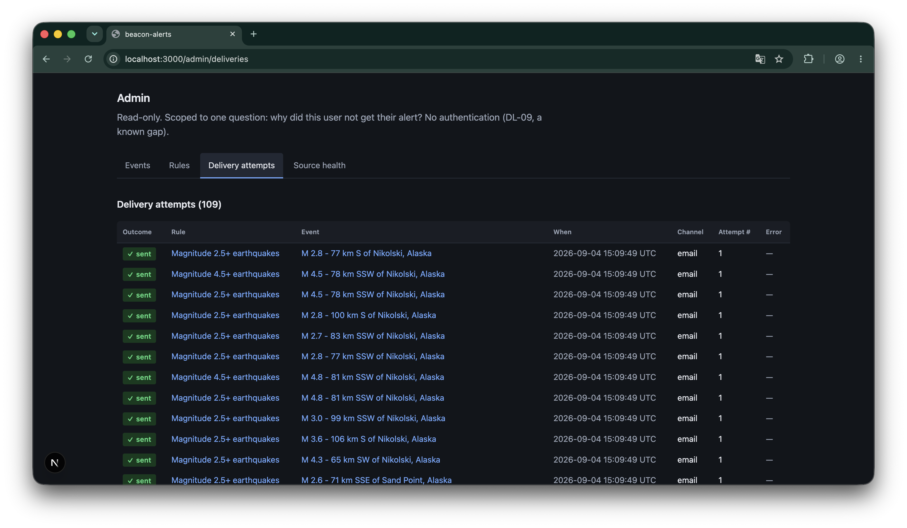

# beacon-alerts

An alerting system built from a deliberately vague one-paragraph brief: users subscribe to
rules, events are ingested from external sources, and matching events are delivered over
email and Slack through a channel abstraction that new channels can be added to.

Built as a take-home exercise for Sonrisa. The exercise is explicit that the process, not
the solution, is what is being evaluated, so this repository is organised as a set of
working documents with an implementation attached as evidence. If you only read two files,
read `docs/00-plan.md` and `docs/04-ai-critique.md`.

---

## Start here

Read in this order:

| File | Why |
|------|-----|
| [`docs/00-plan.md`](docs/00-plan.md) | The plan of attack, written and committed before any code was generated. Deliverables, ordering, timebox, and the scope boundary. |
| [`docs/01-brief-analysis.md`](docs/01-brief-analysis.md) | What the brief actually specifies, what it leaves open, and the questions I would have asked the PM. |
| [`docs/02-architecture.md`](docs/02-architecture.md) | Canonical event model, rule matching, and the channel registry that makes the "add more channels later" requirement real. Sections 2 and 8 are superseded by DL-11 and left as written; the header says why. |
| [`docs/03-decision-log.md`](docs/03-decision-log.md) | Every gap in the brief closed by a named decision, with the option I rejected and the cost I accepted. DL-11 was forced by the source documentation contradicting my own design. |
| [`docs/04-ai-critique.md`](docs/04-ai-critique.md) | Failure predictions registered before generation, what was actually caught, and what I missed. Sections 4 and 5 are the honest accounting. |
| [`prompts/prompt-log.md`](prompts/prompt-log.md) | Every prompt used, in order, with the outcome recorded: accepted, edited, or discarded. |
| [`prompts/drafts/`](prompts/drafts/) | The six prompts written in advance, each with the verification checklist I ran against its output. |
| [`notes/`](notes/) | Agent reports, the design plan, screenshots, and the end-to-end run output. Indexed in `notes/README.md`. |

Tooling: Claude Code v2.1.236, Sonnet 5 at default effort throughout. Held constant on
purpose so the predictions in `docs/04-ai-critique.md` could be scored against one variable.

---

## Running it

Requires Node 24 (see `.nvmrc`).

```bash
npm install                 # postinstall runs prisma generate
cp .env.example .env
npm run setup               # applies migrations and seeds a user, channel, and two rules
npm run dev                 # http://localhost:3000
```

At this point the database has rules but no events, and the admin view will say so. To fetch
real data:

```bash
npm run cycle               # fetch the live USGS feed, ingest, match, dispatch
```

Run `npm run cycle` a second time. It will report zero new events and zero alerts, because
every event is already known and unchanged. That contrast is the deduplication requirement
in section 8 of the plan, and both outputs are recorded in `notes/e2e-run-1.txt` and
`notes/e2e-run-2.txt`.

The suite is 35 tests, all unit-level, no network:

```bash
npm test
```

Admin view routes: `/admin`, `/admin/events`, `/admin/rules`, `/admin/deliveries`,
`/admin/sources`.

Email delivery goes through a logging transport, so no SMTP setup is needed to see the
system work end to end. Slack needs a webhook URL in the environment variable named by the
channel config.

---



## What works

Measured against the definition of done in `docs/00-plan.md` section 8.

- **A rule produces a delivery attempt from a real ingested event.** A live cycle against the
  USGS feed ingested 285 events, evaluated 570 rule-event pairs, and dispatched 108 alerts,
  all visible in the admin view.
- **The second channel adapter was added without touching the dispatcher.** The commit adding
  Slack modified zero existing files. This is the brief's one architectural requirement and
  the git history settles it rather than my description of it.
- **The same event polled twice produces one delivery.** Verified against the live feed, not
  a fixture.
- **A revision across a rule threshold produces one further delivery**, and a revision that
  does not cross one produces nothing. Covered by tests, and a real USGS revision was
  observed behaving correctly during a live cycle.
- **The admin view answers the question it was scoped to.** From a delivery attempt you can
  reach its rule and its event; from an event you can see which rules matched it, and "none"
  where none did. That backwards walk is the point of the surface, per DL-08.
- **The interface is a designed surface, not a default one.** The visual layer was planned
  before it was built (`notes/design-plan.md`); the plan identified the two
  generated-looking defaults in my own earlier version and replaced them with stated reasons;
  every surface reflows to a stacked layout at 380px rather than scrolling sideways.
- **Every gap identified in `docs/01-brief-analysis.md` maps to a decision log entry**, and
  two further decisions were forced during the build rather than derived from the brief.
  Every prompt is logged with its outcome.

## What does not

Stated plainly rather than left for you to find.

- **There is only one event source.** The plan called for a mock news source alongside USGS
  specifically so the architecture would not quietly become an earthquake application, and it
  was never built. The ingestion boundary is designed for multiple sources and demonstrated
  with one, so the pluggability claim on that side is structural rather than proven. The
  delivery side is proven; this side is not.
- **No scheduler.** `npm run cycle` runs one ingestion cycle manually. The polling loop
  described in DL-06 is not wired to a timer.
- **No authentication.** The admin view is unprotected. DL-09 stubs identity, and this is the
  first thing I would add.
- **Email is a logging transport**, not real SMTP. Deliberate: it keeps a dependency decision
  out of the step that was about the abstraction.
- **One condition per rule.** `magnitude >= 6.0 AND tsunami == true` needs two rules and
  produces two alerts. This is a recorded decision, not an oversight, and the extension path
  is in section 4 of the architecture document.
- **Overlapping rules produce duplicate alerts.** The live run shows one magnitude 4.9 event
  alerting twice because it matched both seeded rules. Throttling is in the cut list.
- **DL-11's merge branch assumes exactly two colliding events.** Three-way alias collisions
  are unhandled. The agent found this; I chose not to fix it and recorded why.
- **The seventh transition is untested.** The DL-07 table names six rows and the
  implementation has a seventh (prior record exists, did not match, still does not). It
  returns the obvious answer and no test covers it.
- **The failed-delivery state has not been seen against real data.** Every live delivery
  succeeded through the logging transport, so the failed styling and the retry path are
  covered by tests but were never exercised end to end.

Everything considered and deliberately cut is in section 6 of the plan. That section has not
been revised since the first commit.

---

## Timebox

Budgeted four hours in the plan, and the work took about four and a half. The assignment
allows interruptions, so elapsed time is not the measure: the first commit is at 11:14 and
the last at 20:59, with substantial breaks in between. Both are here because the git log
shows the second one and it would otherwise read as a nine-hour day.

The plan says that if I run over I stop and write up what is unfinished. I went half an hour
over instead of stopping, on two decisions taken separately.

The **admin view** I had provisionally cut as the four-hour mark approached, then reversed:
it is the brief's fourth requirement and the plan's own ordering puts it in scope, so cutting
it would have left a stated requirement unbuilt to protect a self-imposed number.

The **visual layer** was never in the plan at all. I added it because the role is a frontend
position, and four unstyled tables demonstrate none of the judgement that job is about. It is
scoped strictly to presentation: no query, route, data shape, or test changed.

Where the time actually went, roughly: an hour on the documents before any code, two on
ingestion and identity (which absorbed the DL-11 rework), forty minutes on channels, and the
rest on the admin view, the visual layer, verification, and this write-up. The estimate that
was most wrong was setup: a Prisma configuration problem, and a native module compiled
against Node 22 after I upgraded to Node 24 mid-build, together cost more of the budget than
any correctness issue did. The plan's estimates covered only the work, and the Node upgrade
was my own unforced error.